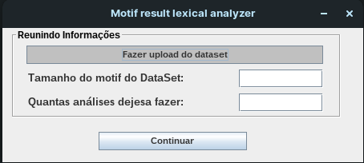
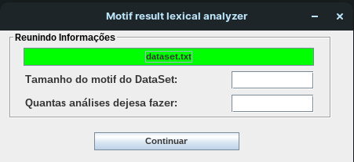

# Analyzer

## Sobre
Este projeto tem como finalidade a leitura, comparação e avaliação dos resultados de análises 
de datasets obtidos a partir APPs terceiros, sendo eles o MEME Suite e o BioProspector. 
Aplicativos estes que tem a função de realizar o encontro de motifs biológicos (podendo ser 
chamados também de padrões biológicos) em sequências de DNAs, RNAs ou proteínas, assunto o qual 
abordei em meu Trabalho de Conclusão de Curso, em que durante sua escrita fez-se a necessidade da 
elaboração de um analisador de arquivos de texto que ao final da leitura do arquivo fosse capaz 
de comparar e gerar métricas de classificação definindo qual dos dois algoritmos de encontro de 
motifs biológicos se saiu melhor na análise do dataset em questão. 
 
Implementado para rodar em sistema Linux, este projeto utiliza da linguagem de programação Java 
na versão 11, e para facilitar a interação do usuário foi utilizada a ferramente Swing, do pró-
prio Java, para criação da tela. O seu código é um tanto quanto simples e objetivo, tendo em vis-
ta o pouco tempo que tive para desenvolvê-lo, porém achei interessante a possibilidade de dispo-
nibilizâ-lo para que pessoas, que assim como eu no início da implementação, tenham dúvidas sobre 
o funcionamento do Java integrado a necessidade da execução de comandos no terminal Linux. Ainda 
além disso, mostro formas de leitura, escrita e criação de arquivos de texto, e como mencionado 
anteriormente, mostro utilização das ferramentas do já antigo e pouco utilizado, porém sempre fa- 
lado, Java Swing.

Com toda certeza a margem para um desenvolvimento muito maior e melhor desta ferramenta, não só 
para este tipo de contexto, e ainda tenho em mente fazer algo do tipo e conto com a sua ajuda!!

## Layout
 
 

## Tecnologias utilizadas
Foi usada apenas no desenvolvimento um tipo de linguagem neste projeto e mais uma outra tecnologia
para criação das telas. Elas como já citadas anteriormente são:

 - Java;
 - Swing;

## Como contribuir
Se você é um desenvolvedor com mais experiência, sempre tem algumas dicas para dar aos mais novos,
então no que puder acrescentar ao meu trabalho e ao meu crescimento como um desenvolvedor, estarei 
sempre de portas abertas para ouvir aos conselhos e ensinamentos que tiveram para dar. 
Abra um issue e contribua da melhor forma que puder!!

## Autor 

 - Caio Henrique Marques da Silva
 - LinkedIn: https://www.linkedin.com/in/caio-henrique-56b713200/
 - Instagram: caiohenrique3